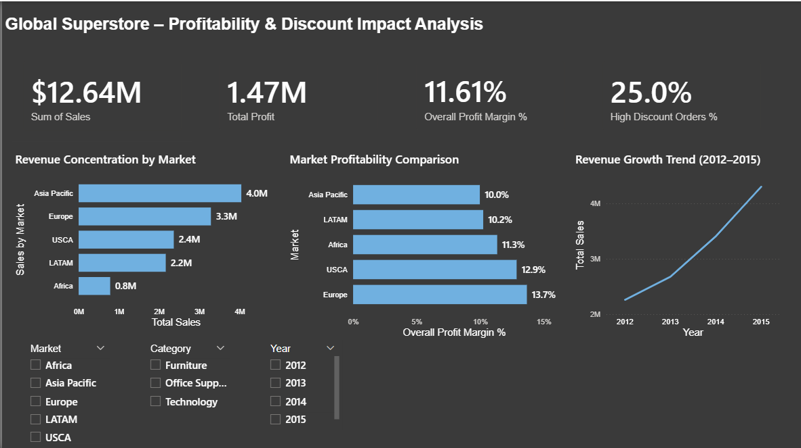

# 📊 Retail Profitability & Discount Impact Analysis – Power BI

## 📌 Project Overview
This project analyzes retail sales performance using the Global Superstore dataset, with a focus on understanding how discount strategies impact profitability across markets, categories and sub-categories.

## 🎯 Business Problem
Retail leadership needed to determine whether aggressive discounting was driving sustainable revenue growth or eroding profit margins.

Key Questions:
- How do discount levels affect overall profit margin?
- Which markets generate high revenue but weak profitability?
- Are specific product categories structurally unprofitable?
- Does shipping cost contribute to margin erosion?

## 🧹 Data Preparation
- Cleaned transactional sales data using Power Query
- Created calculated profit and margin measures
- Developed discount band segmentation (0%, 1–10%, 11–20%, 21%+)
- Built structured data model with relationships

## 📐 Data Modeling
- Fact Table: Clean Orders
- Date dimension table implemented
- DAX measures created for:
  - Total Sales
  - Total Profit
  - Profit Margin %
  - High Discount Revenue %
  - Shipping Cost Analysis

## 📊 Analytical Pages

### 1️⃣ Overview
- Total Sales: $12.64M
- Overall Profit Margin: 11.6%
- High Discount Orders: 25%
- Revenue Growth Trend (2012–2015)

### 2️⃣ Discount Impact
- Profit margin drops sharply beyond 20% discount
- High discount band (>21%) generates negative margin (-42%)
- High discounts drive revenue concentration but destroy profitability

### 3️⃣ Product & Operational Risk
- Tables category structurally unprofitable (-8.5%)
- Shipping cost heavily impacts margin in bulky products
- Sub-category analysis reveals margin variability

### 4️⃣ Strategic Recommendations
- Implement governance controls for discounts above 20%
- Redesign pricing for loss-making categories
- Introduce profitability-based sales incentives
- Monitor high-discount exposure monthly

## 🔍 Key Insights
- Revenue growth does not guarantee profitability.
- Discounting beyond 20% leads to severe margin erosion.
- Certain categories operate at structural loss.
- Shipping costs significantly influence contribution margin.

## 🛠 Tools Used
- Power BI Desktop
- DAX
- Power Query
- Data Modeling
- Data Visualization & Business Storytelling
